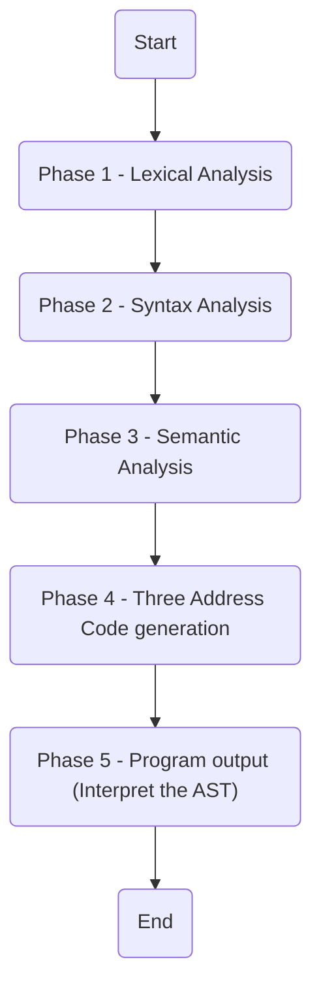

# ToyLang Compiler

This repo contains our implementation of ToyLang, a programming language developed as part of the project component for the course CS F363 - Compiler Construction.

## Features 

ToyLang's features and syntax are documented well in the [Project Description](/Project%20Description.pdf) file, along with a [Context Free Grammar](/CFG.md) for the same.

## How to Run 

> Ensure that Flex, Bison, Make and GCC are installed and in PATH

To build ToyLang, clone this repository and run the `make` command to generate the `toyc` executable.

Once built, run the following:
```shell
$ toyc <input_file> <output_file> 
```

## File Structure

As shown in the diagram below, each stage is separated into its own folder.



## Contributors
- Aman Ranjan (2022A7PS0141H)
- Anirudh Agarwal (2022A7PS0034H)
- Aryan Shrivastava (2022A7PS1653H)
- Dhruv Gupta (2022A7PS0104H)