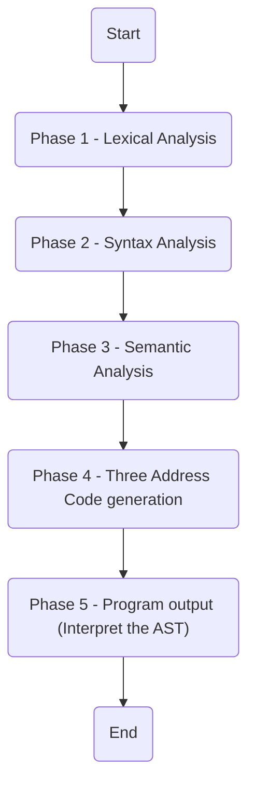
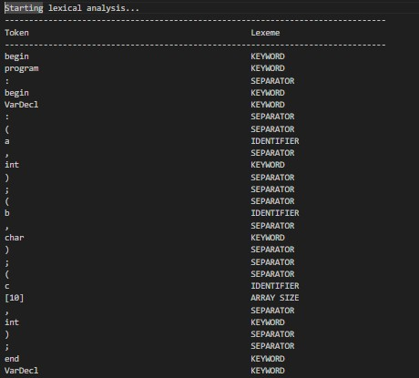
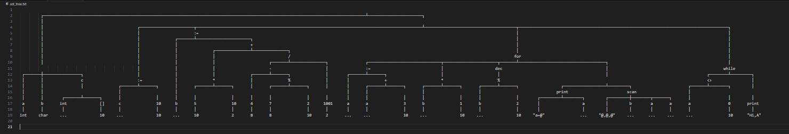

# ToyLang Compiler

This repo contains our implementation of ToyLang, a programming language developed as part of the project component for the course CS F363 - Compiler Construction.

## Features

> ⚠️ Note:
> ToyLang currently supports only single-line `print`, no nested loops/blocks or `scan`, inline with the required deliverables.

ToyLang's features and syntax are documented well in the [Project Description](/Project%20Description.pdf) file, along with a [Context Free Grammar](/CFG.md) for the same.

## How to Run

> Ensure that Flex, Bison, Make and GCC are installed and in PATH

To build ToyLang, clone this repository and run the `make` command to generate the `toyc` executable.

Once built, run the following:

```shell
$ toyc <input_file> <output_file> 
```

## File Structure

As shown in the diagram below, each stage is separated into its own folder.



## Walkthrough from Input to Output

Taking the input file as `sample_input.toy`, the journey from input to output is detailed below:

### Phase 1 - Lexical Analysis

This phase is responsible for reading the stream of characters from the input file and returning a list of tokens (if valid input, an error otherwise). This is done using Flex, with token capturing rules defined in `lexical-analysis/`.

<details>
<summary> A part of the Lexical Analysis' phase output </summary>



</details>

### Phase 2 - Syntax Analysis

After the tokens are generated, they are verified against the [Context Free Grammar](/CFG.md) of ToyLang. This is done using Bison, with the grammar rules defined in `syntax-analysis/`. If the input is valid, an Abstract Syntax Tree (AST) is generated, the code for which lies in `ast-generator/`.

The AST is a generic N-ary tree built as a special Linked List, having nodes containing:

* `type`: An enum representing the type of the node (e.g., `VarDeclBlock`, `AssignStmt`, etc.)
* `data`: A pointer to data the node may hold (e.g., variable names, literal values, etc.)
* `components`: A pointer to a Linked List of nodes that are necessary parts of the structure the current node represents, allowing for a variable number of children per node.
* `nextNode`: A pointer to the next node in the list, allowing for a flat structure that can be traversed easily.

<details>
<summary> The AST generated from the sample input </summary>



</details>

### Phase 3 - Semantic Analysis

After the AST is generated, it is traversed to check for semantic errors such as type mismatches, undeclared variables, etc. This phase is implemented with the help of a Symbol Table, located in `symbol-table/`.

### Phase 4 - Three Address Code Generation

Post semantic analysis, the AST is traversed again to generate the Three Address Code, a popular form of intermediate representation that is platform-agnostic. This is done in `three-address-code/`.

### Phase 5 - Program Output

Finally, a traversal of the AST is performed to produce the final output of the program. This is done in `ast-interpreter/`.

## Contributors

- Aman Ranjan (2022A7PS0141H)
- Anirudh Agarwal (2022A7PS0034H)
- Aryan Shrivastava (2022A7PS1653H)
- Dhruv Gupta (2022A7PS0104H)
